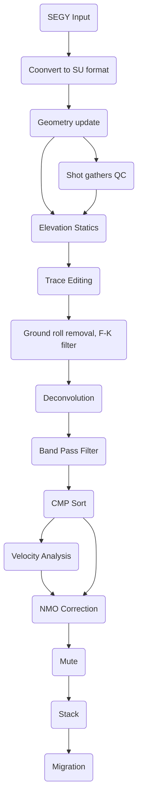

## Table of contents
* [How to install Seismic Unix on Windows](#how-to-install-seismic-unix-on-windows)
* [Ubuntu on Windows](#ubuntu-on-windows)
* [Installing Xming Server](#installing-xming-server)
* [Installing Seismic Unix](#installing-seismic-unix)
* [Seismic processing of 2D line](#seismic-processing-of-2D-line)
  1. [Reading and viewing seismic data](#reading-and-viewing-seismic-data)
  2. [Setting geometry](#setting-geometry)
    - [Python code for geometry headers update](#python-code-for-geometry-headers-update)
  3. [Viewing shot gathers QC](#viewing-shot-gathers-(QC))
  4. [CMP locations QC and binning](#cmp-locations-qc-and-binning)
  5. [Sort data to CMP](#sort-data-to-cmp)

 


### How to install Seismic Unix on Windows
This tutorial will illustrate step by step on how to process seismic data using Seismic Unix. Before starting our Seismic Data Processing journey, some installations need to be made. We will go through all**
### Ubuntu on Windows

The perfect thing to do is to install a Linux partition in your machine (laptop or desktop). In my case I installed Ubuntu [WSL](https://ubuntu.com/wsl) which is a complete Ubuntu terminal environment in on Windows, which is called Windows Subsystem for Linux (WSL)

### Installing Xming Server
In order to run SU modules, an X window server will be needed. in our case I used Xming, which need to be launched after installing Seismic Unix. Here is the [Xming server website for download](http://www.straightrunning.com/XmingNotes/)

### Installing Seismic Unix
Before installing SU, we need to set some environment variables. Add following commands to your profile like .zshrc or .bashrc.

```Shell
export CWPROOT=$HOME
```
```Shell
export PATH=$PATH:$HOME/bin
```
Get SU files from [Seismic-unix.org](https://wiki.seismic-unix.org/doku.php). Here we download the latest version of SU cwp_su_all_44R23.tgz.

Copy the file to $HOME and unzip it by:

```Shell
mv /mnt/c/Users/lzhao/Downloads/cwp_su_all_44R26.tgz ~
```
```Shell
tar xvf cwp_su_all_44R26.tgz
```
After extracting the folder of SU a correction need to be made to the config file:
```Shell
cd src
```
```Shell 
mv Makefile.config Makefile.config.old
```
```Shell
cp ./configs/Makefile.config_Linux_x86_64 ./Makefile.config
```
Installing some packages necessary for Seismic Unix.

```Shell
sudo apt install build-essential
```

```Shell
sudo apt install gfortran
sudo apt install libx11-dev
sudo apt install libxt-dev
sudo apt install freeglut3-dev
sudo apt install libxmu-dev libxi-dev
sudo apt install libc6
sudo apt install libuil4
sudo apt install x11proto-print-dev
sudo apt install libmotif-dev
```
Finally we will install Seismic Unix:
```Shell
make install make xtinstall
make finstall
```
Seismic Unix Should be installed successfully without errors, please ignore the warning messages.
In order to check run the command below:
```Shell
suplane | suximage title="test"
```
**CONGRATULATIONS ON YOUR FIRST SEISMIC UNIX DISPLAY!!!** :satisfied:
### Seismic processing of 2D line
For this tutorial we are going to explain step by step on how to process 2D seismic data using Seismic Unix. The data for this document can be accessed for free [here!](https://dataunderground.org/dataset/poland-vibroseis/resource/96dfd0be-61c8-4edb-9d04-c7d2aeb16d27).
Below is the proposed processing flow chart that we will follow.


### Reading and viewing seismic data
As mentionned before at the beginning of thes notes, our data is in SEGY format and need to be converted to SU format. This is done via:
```Shell
segyread tape=Line_001.sgy endian=0 |suwind key="trid" min="1" > data.su
```
In addition to conversion the code above removes the Auxilliary channels,using key `trid` and `min=1`\

trid: Trace identification\
-1 = Aux data\
1 = Seismic data\

We may use **`surange`** to see if the header settings are correct as shown below:
```Shell
surange < data.su
```


#### Windowing and viewing data
As an example, the code below run a display in wiggles for one shot gather `shot gather FFID#231`. It is always a good idea to look at some small part of the data to check if data exists. 

```Shell
suwind key=fldr min=231 max=231 < seismic.su | suximage perc=99 &
```


### Setting geometry
Geometry definition is one of the most time consuming in processing especially for 2D data. This process is for converting the observed field parameters recorded in observer logs into trace headers.\
For this purpose I wrote a python code which uses the SPS information as input and outputs a text file containig the geometry information (the X, Y coordinates for source and receiver, the offset, and the static information.

### Python code for geometry headers update
Below is the code to run in a Python environment.

```Python
import os
os.chdir(r'C:\Seismic Processing\Seismic_data\2D_Land_vibro_data_2ms')
import math
import csv
fname1 = 'Line_001.SPS'
fname2 = 'Line_001.RPS'
fname3 = 'Line_001.XPS'

nrcv = int(input('Enter total number of Shots: '))
nsrc = int(input('Enter total number of Receivers: '))

# Read each SPS file separately, create lists
fhand = open(fname1)
sp=[]; sx=[]; sy=[]; selev=[];sstat=[]
for line in fhand:
    if not line.startswith('H26'):
        sp.append(line[17:25]); sx.append(line[46:55]); sy.append(line[55:65]); selev.append(line[65:71]); sstat.append(line[28:32])

# Strip all white spaces in sp, sx and sy
sp1 = [i.strip(' ') for i in sp]; sx1 = [i.strip(' ') for i in sx]; sy1 = [i.strip(' ') for i in sy]; selev1 = [i.strip(' ') for i in selev]
sstat1 = [i.strip(' ') for i in sstat]

#Convert rp1, rx1 and ry1 elements to integer
sp1_int=[];sx1_int=[];sy1_int=[];selev1_int=[];sstat1_int=[]
for i in sp1:
    x = int(i); sp1_int.append(x)
for i in sx1:
    x = float(i); sx1_int.append(x)
for i in sy1:
    x = float(i); sy1_int.append(x)
for i in selev1:
    x = float(i); selev1_int.append(x)
for i in sstat1:
    x = float(i); sstat1_int.append(x)

#============================ WORK ON RPS ==========================================================
fhand = open(fname2)
rp=[];rx=[];ry=[];relev=[];rstat=[]
for line in fhand:
    if not line.startswith('H26'):
        line = line.strip()
        rp.append(line[17:25]); rx.append(line[46:55]); ry.append(line[55:65]); relev.append(line[65:71]); rstat.append(line[28:32])

# Strip all white spaces in rp, rx and ry
rp1 = [i.strip(' ') for i in rp]; rx1 = [i.strip(' ') for i in rx]; ry1 = [i.strip(' ') for i in ry]; relev1 = [i.strip(' ') for i in relev]
rstat1 = [i.strip(' ') for i in rstat]

# Convert rp1, rx1 and ry1 elements to integer
rp1_int=[];rx1_int=[];ry1_int=[];relev1_int=[];rstat1_int=[]
for i in rp1:
    x = int(i); rp1_int.append(x)
for i in rx1:
    x = float(i); rx1_int.append(x)
for i in ry1:
    x = float(i); ry1_int.append(x)
for i in relev1:
    x = float(i); relev1_int.append(x)
for i in rstat1:
    x = float(i); rstat1_int.append(x)

dict_selev={sp1_int[i]:selev1_int[i] for i in range(0,251)}
dict_sstat={sp1_int[i]:sstat1_int[i] for i in range(0,251)}
dict_relev={rp1_int[i]:relev1_int[i] for i in range(0,782)}
dict_rstat={rp1_int[i]:rstat1_int[i] for i in range(0,782)}

dict_rps = {'rp': rp1_int, 'rx': rx1, 'ry': ry1}

#============================ WORK ON XPS ==========================================================
fhand=open(fname3)
xp=[];r1=[];r2=[]
for line in fhand:
    if not line.startswith('H26'):
        line = line.strip()
        xp.append(line[29:37]); r1.append(line[63:71]); r2.append(line[71:79])

# Strip all white spaces in xps files
xp1 = [i.strip(' ') for i in xp]; r11 = [i.strip(' ') for i in r1]; r22 = [i.strip(' ') for i in r2]

#Convert xp1, r11(from channel) and r22(to channel) elements to integer
xp1_int=[];r11_int=[];r22_int=[]
for i in xp1:
    x = int(i); xp1_int.append(x)
for i in r11:
    x = int(i); r11_int.append(x)
for i in r22:
    x = float(i); r22_int.append(x)
dict_xps = {'vp': xp1, 'ch_from': r11, 'ch_to': r22} 

dict_sps = {'sp': sp1_int, 'sx': sx1_int, 'sy': sy1_int}
dict_sx={sp1_int[i]:sx1_int[i] for i in range(0,251)}
dict_sy={sp1_int[i]:sy1_int[i] for i in range(0,251)}

dict_rx={rp1_int[i]:rx1_int[i] for i in range(0,782)}
dict_ry={rp1_int[i]:ry1_int[i] for i in range(0,782)}

dict_xps2={int(xp1[i]):[*range(int(r11[i]),int(r22[i])+1)] for i in range(0,251)}

#INDEX of VP 701 (dict_xps2[int(dict_xps['vp'][i])][0])
'''
=====================================================================
Calculate the offset matrix for each VP corresponding to all traces 
collaborated to that particular VP
=====================================================================
'''
offset=[];xcord_s=[];ycord_s=[];xcord_r=[];ycord_r=[];src_elev=[];src_stat=[];rcv_elev=[];rcv_stat=[]
for i in range(0,251):
    for j in range(0,282):
        if int(dict_xps['vp'][i]) in sp1_int and int(dict_xps['ch_from'][i]) in rp1_int and int(dict_xps['ch_to'][i]) in rp1_int:
            xcor_r = float(dict_rx[dict_xps2[int(dict_xps['vp'][i])][j]])
            ycor_r = float(dict_ry[dict_xps2[int(dict_xps['vp'][i])][j]])
            r_elev = float(dict_relev[dict_xps2[int(dict_xps['vp'][i])][j]])
            r_stat = float(dict_rstat[dict_xps2[int(dict_xps['vp'][i])][j]])

            xcor_s = float(dict_sx[float(dict_xps['vp'][i])])  
            ycor_s = float(dict_sy[float(dict_xps['vp'][i])])
            s_elev = float(dict_selev[float(dict_xps['vp'][i])])
            s_stat = float(dict_sstat[float(dict_xps['vp'][i])])

            ox = xcor_r - xcor_s; oy = ycor_r - ycor_s; offs = math.sqrt(ox*ox + oy*oy)
            
            if int(dict_xps['vp'][i]) > int(dict_xps2[int(dict_xps['vp'][i])][j]):
                offs = offs * (-1)

            offset.append(offs)
            xcord_s.append(xcor_s)
            ycord_s.append(ycor_s)
            xcord_r.append(xcor_r)
            ycord_r.append(ycor_r)
            src_elev.append(s_elev)
            src_stat.append(s_stat)
            rcv_elev.append(r_elev)
            rcv_stat.append(r_stat)

with open('geometry.txt', 'w', newline='\n') as f:
    writer = csv.writer(f, delimiter=' ')
    for data in zip(xcord_s, ycord_s, src_elev, src_stat, xcord_r, ycord_r, rcv_elev, rcv_stat, offset):
        writer.writerow(data)
    f.write('\n')
```
Before proceeding to the geometry, we need to convert the geometry information from the text file into a binary format, then load the binary information into data to apply the geometry.

```Shell
a2b < geometry.txt n1=9 > myheaders.bin
```
n1=9 indicates number of columns in the geometry text file. After appying the geometry we can notice that headers are correctly updated including the offset and X 1 Y coordinates.


### Viewing shot gathers QC

```Shell
suwind key=ep min=100 max=100 < data_geom2.su | suximage key=offset cmap=hsv4 perc=90\
                title="shot100 after geometry" label1="Time(s)" label2="Offsset(m)"  &
```


Another QC we can look at the source and receiver locations, first thing to do is to create the binary files that contain the coordinates information (X and Y) for both source and receiver.

```Gawk
gawk '{print $1,$2}' < geometry.txt |sort|uniq|a2b > srcloc.bin
gawk '{print $5,$6}' < geometry.txt |sort|uniq|a2b > rcvloc.bin
```
Now we have the binary information of the source and receiver locations in those two files, we concatenate them and we plot data  using psgraph. The process is described in a bash script `04_geom_qc1.job`

```sh
#!/bin/bash

cat srcloc.bin rcvloc.bin |
	psgraph n=251,782 linecolor=red,blue wbox=16 hbox=3.5 \
	d1num=1000 d2num=1000 \
	labelsize=9 grid1=solid grid2=solid gridcolor=gray marksize=1,1 \
	gridwidth=0 linewidth=0,0 title="Source & Receiver Locations" \
	label1=Easting label2=Northing > SrcRcv_loc_map.ps
```
The generated post graph file .ps can be viewed using line command:

```sh
gv SrcRcv_loc_map.ps
```


### CMP locations QC and binning

It is well known that a straight 2D line, a CMP location is defined as the midpoint between the source and the receiver locations. On a crooked line (our case), CMPs may do not lie on the line of source and receiver.\
So, let’s plot the CMPs locations using same script as before. But this time calculating the midpoint locations of CMPs using the provided information in the geometry text file.

```gawk
#!/bin/bash

gawk '{print ($1+$5)/2,($2+$6)/2}'<myheaders_new.txt |a2b > cmploc.bin
	cat cmploc.bin srcloc.bin rcvloc.bin |
	psgraph n=70782,251,782 linecolor=green,red,blue wbox=16 hbox=3.5 \
	d1num=1000 d2num=1000 \
	labelsize=9 grid1=solid grid2=solid gridcolor=gray marksize=0.5,1,1 \
	gridwidth=0 linewidth=0,0 title="Source Receiver and CMPs locations"\
	label1=Easting label2=Northing > SrcRcvCmp_loc_map.ps
```
Let's plot via the command:
```sh
gv SrcRcvCmp_loc_map.ps
```


It is well noticed in the graph that we are dealing with a crooked line, CMPs are not falling between source and receiver, so a a possible solution to this is to do binning. let's tak teh receiver line, then we can project all actual CMP locations to the nearest point on the receiver line.\
In order to choose the best parameter for the maximum offset distance between a cmp location and the cmp line which is supposed to be the `receiver line`. After several tests as described int the shell script, the Maximum offline distance that we choose is 200m.

```sh
#!/bin/bash

# Set up a command to concatenate some plot files for comparing off-line distances accepted
convert="cat "

# Set the CMP interval
dcdp=12.5

# Loop through several offline distances and compare results.
for distmax in 12.5 25 50 100 200 500
do
	echo Running crooked line binning for maximimum offline distance $distmax into $dcdp m bins

	sucdpbin <data_geom2.su xline=684590.2,697315.1,703807.7 yline=3837867.6,3839748.8,3841277.2 verbose=2 dcdp=$dcdp distmax=$distmax 2>cdp.log |suwind key=cdp min=1 > geomdata_cmps_$distmax.su

	echo Creating chart data
	suchart < geomdata_cmps_$distmax.su key1=cdp key2=offset >plotdata outpar=par

	echo Running Postscript graphing routine
	psgraph <plotdata par=par linewidth=0 mark=0 marksize=1 labelsize=6 titlesize=12 linecolor=blue wbox=13 hbox=10 >plot$distmax.ps title="Maximum offline distance $distmax m  - $dcdp m Bins"

	convert="$convert plot$distmax.ps"
done

# Now concatenate the Postscript files in the same order they were created, so the resulting multipage file can be opened and the effects of changing the offline distance parameter
$convert > crookedLine_bining.ps
```
Let's plot the stacking chart, which is a plot of the header CDP field versus the offset field. We can notice the white stripes indicating missing shots.

```sh
gv crookedLine_bining.ps
```


### Sort data to CMP


</details>

<!--
  <<< Author notes: Footer >>>
  Add a link to get support, GitHub status page, code of conduct, license link.
-->

---

Get help: [Post in our discussion board](https://github.com/skills/.github/discussions) &bull; [Review the GitHub status page](https://www.githubstatus.com/)

&copy; 2022 GitHub &bull; [Code of Conduct](https://www.contributor-covenant.org/version/2/1/code_of_conduct/code_of_conduct.md) &bull; [CC-BY-4.0 License](https://creativecommons.org/licenses/by/4.0/legalcode)
