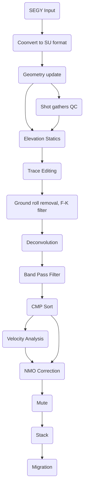

## Table of contents
* [How to install Seismic Unix on Windows](#how-to-install-seismic-unix-on-windows)
* [Ubuntu on Windows](#ubuntu-on-windows)
* [Installing Xming Server](#installing-xming-server)
* [Installing Seismic Unix](#installing-seismic-unix)
* [Seismic processing of 2D line](#seismic-processing-of-2D-line)
  1. [Reading and viewing seismic data](#reading-and-viewing-seismic-data)
  2. [Setting geometry](#setting-geometry)
    - [Python code for geometry headers update](#python-code-for-geometry-headers-update)
  3. [Viewing shot gathers QC](#viewing-shot-gathers-(QC))
  4. [Sort data to CMP](#sort-data-to-cmp)
    - [CMP locations QC and binning](#cmp-locations-qc-and-binning)
 


### How to install Seismic Unix on Windows
This tutorial will illustrate step by step on how to process seismic data using Seismic Unix. Before starting our Seismic Data Processing journey, some installations need to be made. We will go through all**
### Ubuntu on Windows

The perfect thing to do is to install a Linux partition in your machine (laptop or desktop). In my case I installed Ubuntu [WSL](https://ubuntu.com/wsl) which is a complete Ubuntu terminal environment in on Windows, which is called Windows Subsystem for Linux (WSL)

### Installing Xming Server
In order to run SU modules, an X window server will be needed. in our case I used Xming, which need to be launched after installing Seismic Unix. Here is the [Xming server website for download](http://www.straightrunning.com/XmingNotes/)

### Installing Seismic Unix
Before installing SU, we need to set some environment variables. Add following commands to your profile like .zshrc or .bashrc.

```Shell
export CWPROOT=$HOME
```
```Shell
export PATH=$PATH:$HOME/bin
```
Get SU files from [Seismic-unix.org](https://wiki.seismic-unix.org/doku.php). Here we download the latest version of SU cwp_su_all_44R23.tgz.

Copy the file to $HOME and unzip it by:

```Shell
mv /mnt/c/Users/lzhao/Downloads/cwp_su_all_44R26.tgz ~
```
```Shell
tar xvf cwp_su_all_44R26.tgz
```
After extracting the folder of SU a correction need to be made to the config file:
```Shell
cd src
```
```Shell 
mv Makefile.config Makefile.config.old
```
```Shell
cp ./configs/Makefile.config_Linux_x86_64 ./Makefile.config
```
Installing some packages necessary for Seismic Unix.

```Shell
sudo apt install build-essential
```

```Shell
sudo apt install gfortran
sudo apt install libx11-dev
sudo apt install libxt-dev
sudo apt install freeglut3-dev
sudo apt install libxmu-dev libxi-dev
sudo apt install libc6
sudo apt install libuil4
sudo apt install x11proto-print-dev
sudo apt install libmotif-dev
```
Finally we will install Seismic Unix:
```Shell
make install make xtinstall
make finstall
```
Seismic Unix Should be installed successfully without errors, please ignore the warning messages.
In order to check run the command below:
```Shell
suplane | suximage title="test"
```
**CONGRATULATIONS ON YOUR FIRST SEISMIC UNIX DISPLAY!!!** :satisfied:
### Seismic processing of 2D line
For this tutorial we are going to explain step by step on how to process 2D seismic data using Seismic Unix. The data for this document can be accessed for free [here!](https://dataunderground.org/dataset/poland-vibroseis/resource/96dfd0be-61c8-4edb-9d04-c7d2aeb16d27).
Below is the proposed processing flow chart that we will follow.


### Reading and viewing seismic data
as explained before, our data is a 2D vibroseis data, Line 001. The data is in SEGY format, and need to be read into SU data format. This is done via:
```Shell
segyread tape=Line_001.sgy endian=0 |suwind key="trid" min="1">data.su
```
The above line of code converts data from SEGy to SU format and in addition will remove the Auxilliary channels\
"-1" = AUX data\
"1" = Seismic data.\
We may use **`surange`** to see if the header settings are correct as shown below:
```Shell
surange < data.su
```
[image](https://github.com/hadi-tim/sdp-seismic-unix/tree/main/images/surange.png?raw=true)

### Setting geometry

### Python code for geometry headers update


### Viewing shot gathers QC


### Sort data to CMP


### CMP locations QC and binning
</details>

<!--
  <<< Author notes: Footer >>>
  Add a link to get support, GitHub status page, code of conduct, license link.
-->

---

Get help: [Post in our discussion board](https://github.com/skills/.github/discussions) &bull; [Review the GitHub status page](https://www.githubstatus.com/)

&copy; 2022 GitHub &bull; [Code of Conduct](https://www.contributor-covenant.org/version/2/1/code_of_conduct/code_of_conduct.md) &bull; [CC-BY-4.0 License](https://creativecommons.org/licenses/by/4.0/legalcode)
